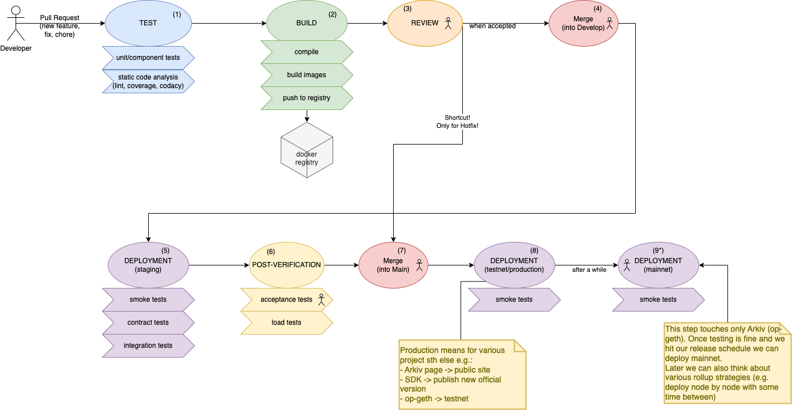

## CI/CD flow (from PR to production)

This diagram shows our intended CI (Continuous Integration) and CD (Continuous Delivery/Deployment) pipeline flow, starting from a developer opening a Pull Request and ending with a production-ready release.

The numbered steps below correspond to the numbers on the diagram.

### 1. TEST

The first phase after a PR is proposed should be **fast, cheap, and reliable** checks that provide immediate feedback.

- **What runs here**
  - Unit tests and component tests
  - Static code analysis such as linting, formatting checks, code quality rules
  - Security and quality gates where applicable (e.g. SAST), plus test coverage reporting
- **Why it matters**
  - Catches regressions early (before reviewers spend time on broken changes)
  - Provides a baseline quality bar that is easy to adopt in most projects
  - Keeps PR iteration loops short by failing quickly on obvious issues

### 2. BUILD

The build phase creates **shippable artifacts**.

- **What runs here (depends on project nature)**
  - Compiling/linking into binaries
  - Building Docker images (one or many), packaging libraries, etc.
  - Publishing artifacts to the right place (e.g. container registry / artifact store)
- **Why it matters**
  - Verifies the code is buildable in a clean CI environment (not only on a developer machine)
  - Produces immutable artifacts that can later be promoted and deployed consistently

### 3. REVIEW

We want to keep a culture of code reviews: whenever possible, at least one **non-author** should review the proposed changes.

- **Why it matters**
  - Improves correctness, readability, and long-term maintainability
  - Spreads knowledge about the codebase and reduces “single point of failure”
  - Helps spot risks that automated checks typically do not catch (edge cases, architecture, UX)

### 4. Merge into `develop`

Merging into `develop` is the first integration point and should happen only when the PR meets our quality bar.

- **Requirements**
  - CI steps from **TEST** and **BUILD** are green
  - **Review accepted** by at least one non-author (when more than one developer is active)
- **How we enforce it**
  - Use GitHub branch protection rules (required checks + required approvals) to prevent bypassing gates
- **Why it matters**
  - Keeps `develop` in a healthy, integrated state and reduces integration surprises for everyone

### 5. DEPLOYMENT to staging/testing environment

Once code lands in `develop`, it should be deployed to a **staging/testing** environment (preferably automatically).

- **Why it matters**
  - Makes the latest integrated version available to a broader audience (e.g. product owner, related teams)
  - Allows running additional verification that is impractical to run on every PR
- **Typical checks here**
  - Smoke tests (basic “is it up?” and key paths)
  - Integration tests (cross-module / cross-service behavior)
  - Contract tests (when relevant; this area may require project-specific research and design)

### 6. POST-VERIFICATION (optional, project-dependent)

This step is reserved for some projects because it is typically **time- and resource-consuming**. It usually runs against the staging environment before the final decision to promote to production.

- **Examples**
  - Load/stress tests for projects exposed to large traffic (e.g. the arkiv-node execution client)
  - Acceptance testing performed by product owner/stakeholders for user-facing products where quality is highly visible (e.g. Arkiv main page)
- **Why it matters**
  - Reduces release risk by validating performance and end-to-end expectations before production

### 7. Merge into `main` (release trigger)

Merging into `main` is the moment that triggers an actual production release. The `main` branch represents the production-ready state.

- **What we expect here**
  - Release is tagged (for traceability and tooling integration)
  - Tags make it easier to manage history, generate changelogs, and integrate with release tooling (e.g. GitHub Releases)

### 8. DEPLOYMENT to production (or release target)

At this point the product is released to its production target. “Production” may mean different things depending on the project:

- **Examples**
  - Publishing a library (e.g. Python package to PyPI, JS package to npm) for SDK-type projects
  - Deploying a production website (e.g. Arkiv main page)
  - Deploying a public testnet environment for a L3 network project
- **Also recommended**
  - Production smoke tests (or equivalent verification) to confirm the fresh release is healthy

### 9\*. DEPLOYMENT to mainnet (Arkiv L3 only)

This is an extra step reserved for L3 network projects that require additional care. Most projects end their release cycle at step 8.

- **Why it’s different**
  - Promotion to mainnet should happen only after operating safely in testnet for a while
  - It should follow a planned release schedule (often coordinated with marketing campaigns)

### Hotfix shortcut (exception)

There is a shortcut for hotfixes: changes are made on a branch derived from a specific released tag (i.e. from `main` / a release point) and then released quickly. **However, the hotfix must be synced back into `develop` as soon as possible** to avoid long-lived divergence.

### Notes / caveats

- This is an **idealized pipeline** for exposed public projects; details should be adapted per project.
- Some projects may have **fewer tests** or a lower quality bar if the impact is low (e.g. demo cases).
- Some projects may have **no review step** if there is only a single developer working on the project.
- Some projects may have **no staging environment** (e.g. demo cases).
- Some kinds of tests make more or less sense depending on project nature; this should be judged by **project owners**.
- The “actor” icon on the diagram means the step is mostly **manual**; the rest we should try to **automate as much as possible**.
